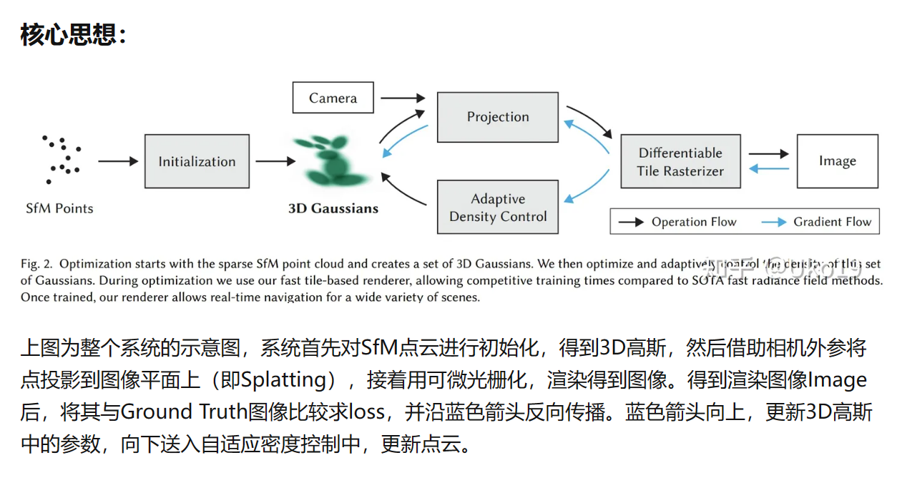
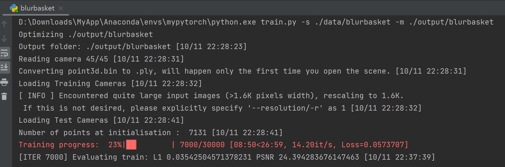
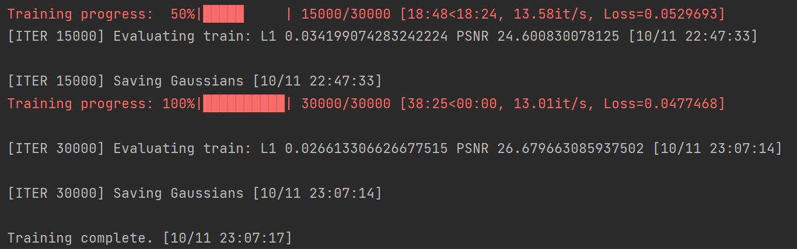
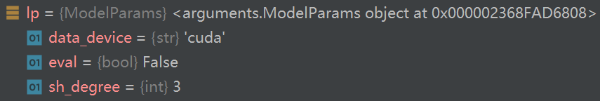
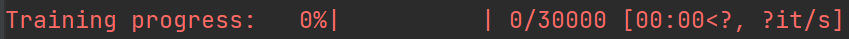

## 论文

- anisotropic
- unbounded and complete scenes

> https://zhuanlan.zhihu.com/p/660512916

- Footprint Table




## 代码

- 运行结果





### train.py

```sh
python train.py -s ./data/... -m ./output/...
```

- 从 `train.py` 的主函数开始

- 创建 `parser` ，传入`parser`作为参数，使用函数创建三个实例，然后给parser添加相关参数（`op`截图不完整）

```python
lp = ModelParams(parser)
op = OptimizationParams(parser)
pp = PipelineParams(parser)

parser.add_argument('--ip', type=str, default="127.0.0.1")
...
```




- 解析参数，传入`args`变量

```python
args = parser.parse_args(sys.argv[1:])
```

- 开启 GUI 服务器

```python
network_gui.init(args.ip, args.port)

# network_gui.py
def init(wish_host, wish_port):
    global host, port, listener
    host = wish_host
    port = wish_port
    listener.bind((host, port))
    listener.listen()
    listener.settimeout(0)
```

- 将`args.detect_anomaly`的值设置为自动梯度异常检测功能的状态

```python
torch.autograd.set_detect_anomaly(args.detect_anomaly)
```

- 开始训练

```python
training(lp.extract(args), op.extract(args), pp.extract(args), 
args.test_iterations, args.save_iterations, args.checkpoint_iterations, 
args.start_checkpoint, args.debug_from)
```

（训练结束后，输出 `print("\nTraining complete.")`，`train.py`全部结束）

调用 `train` 函数

- 准备tensorboard记录

```python
tb_writer = prepare_output_and_logger(dataset)
```

- 创建高斯模型对象

```python
gaussians = GaussianModel(dataset.sh_degree)

# 进入gaussian_model.py
self.max_sh_degree = sh_degree  # 该model的__init__函数中
# 退出
```

- 初始化场景对象

```python
scene = Scene(dataset, gaussians)

# Scene类定义在 __init__.py 中
```

进入 `__init__.py` 

- 读取colmap数据（sparse等）
- 将 points3D.ply 复制给 input.ply
- 将场景的camera数据存入列表，并遍历列表，依次将相机对象转换为json格式保存在json_cams列表中（数据集照片的数量就是camera列表的长度），并将其保存在camera.json中
- 保证多分辨率一致性的情况下对cameras进行shuffle
- 从场景信息中获取相机视野范围

```python
self.cameras_extent = scene_info.nerf_normalization["radius"]
# radius 视野范围的半径
```

- 将场景中点云信息转化为高斯分布（pcd是点云对象）

```python
self.gaussians.create_from_pcd(scene_info.point_cloud, self.cameras_extent)
```

进入 `gaussian_model.py`

```python
def create_from_pcd(self, pcd:BasicPointCloud, spatial_lr_scale:float):
  ...
  # 将点云的颜色从RGB转换为SH（色相、饱和度和明度）
  fused_color = RGB2SH(torch.tensor(np.asarray(pcd.colors)).float().cuda())
  # 初始化一个形状为(fused_color.shape[0], 3, (self.max_sh_degree + 1) ** 2)
  # 的特征张量，并将颜色设置为第一层。
  features = torch.zeros((fused_color.shape[0], 3, (self.max_sh_degree + 1) ** 2)).float().cuda()
  features[:, :3, 0 ] = fused_color
  features[:, 3:, 1:] = 0.0
  
  ...
  # 计算点云中每个点到原点的距离的平方（dist2）
  # 计算点到原点的尺度（scales），并将其转换为log空间
  # 初始化旋转矩阵（rots）不透明度（opacities）
  # 将点云的坐标、特征等设置为nn.Parameter，以便在训练过程中进行梯度更新
  # 初始化max_radii2D
```

退出 `gaussian_model.py`

退出 `__init.py` 

回到 `train` 函数中

- 设置训练过程中的参数，如学习率、优化器等。

```python
gaussians.training_setup(opt)

# 进入gaussian_model.py
# 调用 training_setup 函数
...
# 创建一个优化器，参数列表为l(l是学习率列表)，学习率为0.0，小批量梯度平方的衰减率为1e-15。
self.optimizer = torch.optim.Adam(l, lr=0.0, eps=1e-15)

# 定义一个学习率调度器，用于训练过程中逐步增加学习率
self.xyz_scheduler_args = get_expon_lr_func(lr_init=training_args.position_lr_init*self.spatial_lr_scale,
                                                    lr_final=training_args.position_lr_final*self.spatial_lr_scale,
                                                    lr_delay_mult=training_args.position_lr_delay_mult,
                                                    max_steps=training_args.position_lr_max_steps)
# 退出 gaussian_model.py
```

- 设置计算训练时间消耗
- 定义损失变量 `ema_loss_for_log` 
- 设置tqdm
- 开始迭代

```python
for iteration in range(first_iter, opt.iterations + 1):
```

- Every 1000 its we increase the levels of SH up to a maximum degree
- 随机选一个 camera 给 viewpoint_cam
- 开始 render

```python
render_pkg = render(viewpoint_cam, gaussians, pipe, bg)
image, viewspace_point_tensor, visibility_filter, radii = render_pkg["render"], render_pkg["viewspace_points"], render_pkg["visibility_filter"], render_pkg["radii"]
```

进入 `gaussian_renderer\__init__.py`

- 创建一个零张量，这个张量将用于记录2D屏幕空间点（screen-space points）的梯度
- 设置透视投影的配置
- 设置光栅化配置

```python
raster_settings = GaussianRasterizationSettings(
        image_height=int(viewpoint_camera.image_height),
        image_width=int(viewpoint_camera.image_width),
        tanfovx=tanfovx,
        tanfovy=tanfovy,
        bg=bg_color,
        scale_modifier=scaling_modifier, #缩放因子
        # 视点摄像机在世界坐标系下的 viewing matrix（视图矩阵）
        viewmatrix=viewpoint_camera.world_view_transform,
        # 视点摄像机在投影矩阵下的投影矩阵
        projmatrix=viewpoint_camera.full_proj_transform,
        sh_degree=pc.active_sh_degree, # 高斯模糊的指数
        campos=viewpoint_camera.camera_center, # 摄像机中心的位置
        prefiltered=False, # 是否预过滤
        debug=pipe.debug # false
    )
```

- 创建一个高斯光栅化器

```python
rasterizer = GaussianRasterizer(raster_settings=raster_settings)
```

- 分别从点云对象pc中获取xyz坐标、屏幕空间坐标和透明度信息，并将这些信息分别存储在means3D、means2D和opacity变量中。
- 初始化三个变量：scales、rotations和cov3D_precomp
- 初始化或设置三个变量：shs、colors_precomp和override_color

```python
...(if else 判断后选择)
shs = pc.get_features
```

- 使用光栅化（rasterizer）将可见的高斯分布绘制到图像中，并获取它们的半径（在屏幕上）(shs和colors_precomp是互斥的)
- 返回了一个字典，其中包含了四个键值对：render：渲染后的图像; viewspace_points：视空间点（在摄像机视口坐标系下的点); visibility_filter：可见性过滤器，用于过滤出可见的点云; radii：半径向量，表示每个点云在屏幕上的半径大小。

退出 `gaussian_renderer\__init__.py` 

回到 `train` 函数中

- image 和 gt_image 求L1 Loss
- 加上SSIM损失
- 反向传播

```python
gt_image = viewpoint_cam.original_image.cuda()
Ll1 = l1_loss(image, gt_image)
loss = (1.0 - opt.lambda_dssim) * Ll1 + opt.lambda_dssim * (1.0 - ssim(image, gt_image))
loss.backward()
# lambda_dssim是个超参数，第一轮时是0.2
# 控制了第一部分损失（Ll1损失）和第二部分损失（SSIM损失）的权重。
```

- 取消梯度计算（通常当验证或测试阶段）

```python
with torch.no_grad():
```

- 计算损失（loss）的指数移动平均值（EMA），每十轮打印，作为该时刻的Loss

```python
ema_loss_for_log = 0.4 * loss.item() + 0.6 * ema_loss_for_log
```

- 更新 Progress bar
- 保存 log
- Densification 操作。密集化是一种在训练过程中，通过增加高斯点云的密度，从而提高模型性能的技术。
- 在迭代次数小于 densify_until_iter 时，更新 gaussians 信息
- 同时大于 densify_from_iter 且 `iteration % opt.densification_interval==0`，则进行 densification 操作
- 进行密集化和剪枝：使用指定的梯度阈值（opt.densify_grad_threshold）和透明度阈值（0.005）进行密集化和剪枝操作，同时使用场景中摄像机的位置和视野范围作为剪枝的尺寸阈值（scene.cameras_extent）

```python
size_threshold = 20 if iteration > opt.opacity_reset_interval else None
gaussians.densify_and_prune(opt.densify_grad_threshold, 0.005, scene.cameras_extent, size_threshold)
```

进入 `gaussian_model.py`

```python
    def densify_and_prune(self, max_grad, min_opacity, extent, max_screen_size):
        grads = self.xyz_gradient_accum / self.denom
        grads[grads.isnan()] = 0.0

        # 根据梯度分别处理
        self.densify_and_clone(grads, max_grad, extent)
        self.densify_and_split(grads, max_grad, extent)

        prune_mask = (self.get_opacity < min_opacity).squeeze()
        if max_screen_size:
            big_points_vs = self.max_radii2D > max_screen_size
            big_points_ws = self.get_scaling.max(dim=1).values > 0.1 * extent
            prune_mask = torch.logical_or(torch.logical_or(prune_mask, big_points_vs), big_points_ws)
        # 根据透明度阈值和高斯点云的大小阈值，筛选出需要剪枝的点云
        self.prune_points(prune_mask)

        torch.cuda.empty_cache()
```

退出 `gaussian_model.py`

回到 `train` 函数中

- 优化器更新参数
- 将高斯点云的梯度清零，以准备进行下一轮迭代

```python
gaussians.optimizer.step()
gaussians.optimizer.zero_grad(set_to_none = True)
```

- 一轮训练结束
- 进行30000轮训练


