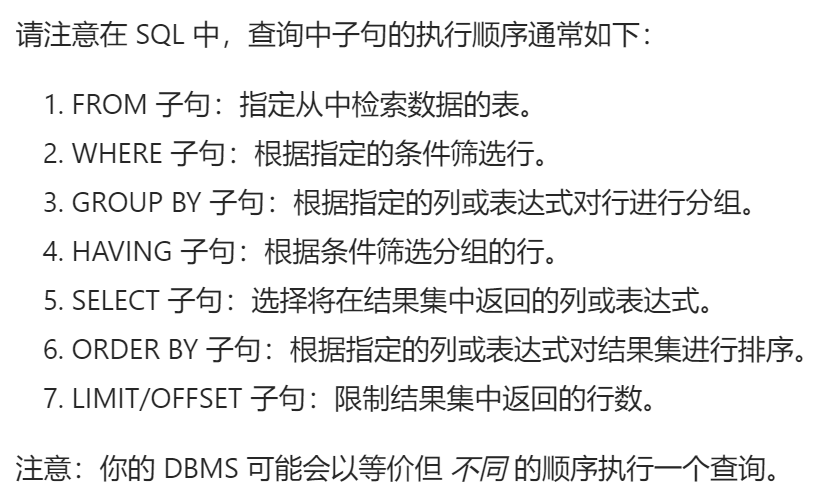

# 代码题相关

### C++ STL

##### string

1. 指定位置插入 `s.insert(i,1,'a'); // pos,len,str`​
2. 指定位置替换 `s.replace(i,1,'a'); // pos,len,str`​
3. 末尾插入 `s.push_back('a'); // 搭配reserve使用比较好`​
4. 提取子串 `s.substr(pos,len);`​

##### unordered_map

1. 比较操作：维护状态时，注意值为0时依旧键存在，需要使用 `erase`​ 删除这个键才能得到 `==`​ 成立

##### vector

1. ​`emplace_back`​ ：与 `push_back`​ 不同，`emplace_back`​ 是通过就地构造（in-place construction）的方式来添加元素，而不是先创建一个临时对象，然后再将其拷贝或移动到 vector 中。这在某些情况下可以提高性能，特别是当元素类型的构造函数比较复杂或者拷贝 / 移动构造函数开销较大时。需要注意的是，`emplace_back`​ 接受的参数是传递给元素类型的构造函数的参数，而不是已经构造好的对象。

##### pair

1. ​`pair<int,int>a;cout<<a.first<<"\n"; // first后面没有括号`​

##### else

1. 注意插入删除后，`while`​循环中的`i`​，`j`​下标可能需要改变（比如使用`replace`​后）

### SQL

1. ​`outer join`​ 使用

    ​`left join`​ 左表中有的全部展示，其中右表查询不到的输出 `null`​

    默认的 `inner join`​ 则会不输出含义 `null`​ 的行

    ​`on`​ 子句主要用于在 `JOIN`​ 操作（如 `INNER JOIN`​、`LEFT JOIN`​ 等）中指定连接条件，用于匹配两个或多个表之间的相关记录。

    ```sql
    select FirstName,LastName,City,State
    from Person left join Address
    on Person.PersonId=Address.PersonId
    ```

2. 将查询返回值作为判断条件，实现查找第二大的元素，以及 `max`​ 使用

    ```sql
    select max(salary) as SecondHighestSalary
    from Employee
    where salary < (select max(salary) from Employee)
    ```
3. ​`limit`​ 用法

    ​`limit offset, n`​ 跳过 `offset`​ 个，取后续 `n`​ 个
4. ​`ifnull`​ 用法

    ​`ifnull(非空返回值，为空时返回值)`​

    ```sql
    select ifnull(
    (select salary
    from Employee
    order by salary desc
    limit 1,1),null) as SecondHighestSalary
    ```

5. ​`select distinct salary from Employee`​ 用于去重
6. ​
7. ​`set N=N-1;`​ 函数中设置或初始化变量
8. ​`where`​ 用法

    ```sql
    select p.product_id
    from Products as p
    where p.low_fats='Y' and p.recyclable='Y';
    ```

9. ​`IS NULL`​ 或者 `IS NOT NULL`​

    MySQL 使用三值逻辑 —— `TRUE`​, `FALSE`​ 和 `UNKNOWN`​。任何与 `NULL`​ 值进行的比较都会与第三种值 `UNKNOWN`​ 做比较。这个“任何值”包括 `NULL`​ 本身！这就是为什么 `MySQL`​ 提供 `IS NULL`​ 和 `IS NOT NULL`​ 两种操作来对 `NULL`​ 特殊判断。

    ​`SELECT name FROM customer WHERE referee_id <> 2 OR referee_id IS NULL;`​ 以及 `<>`​是不等号
10. ​`<=>`​ 操作符和 `=`​ 操作符类似，不过 `<=>`​ 可以用来判断 `NULL`​ 值，具体语法规则为：  
     当两个操作数均为 `NULL`​ 时，其返回值为 `1`​ 而不为 `NULL`​；  
     而当一个操作数为 `NULL`​ 时，其返回值为 `0`​ 而不为 `NULL`​。
11. 在 `SQL`​ 的 `SELECT`​ 语句中，`WHERE`​ 子句用于筛选行，必须放在 `FROM`​ 子句之后，`ORDER BY`​ 子句之前。`ORDER BY`​ 子句用于对查询结果进行排序，要放在 `WHERE`​ 子句、`GROUP BY`​ 子句（如果有的话）等之后。
12. ​`char_length`​ 用于计算字符串中字符数的最佳函数

### 多线程

1.  `sem_t`​ `sem_init(&p,pshared,value);`​ `sem_post(&p);sem_wait(&p);`​

    ```cpp
    /*
     * @lc app=leetcode.cn id=1114 lang=cpp
     *
     * [1114] 按序打印
     */
    // @lc code=start
    #include<semaphore.h>
    class Foo {
    public:
        sem_t pf;
        sem_t ps;
        Foo() {
            sem_init(&pf,0,0);
            sem_init(&ps,0,0);
        }
        void first(function<void()> printFirst) {
            printFirst();
            sem_post(&pf);
        }
        void second(function<void()> printSecond) {
            sem_wait(&pf);
            printSecond();
            sem_post(&ps);
        }
        void third(function<void()> printThird) {
            sem_wait(&ps);
            printThird();
        }
    };
    // @lc code=end
    ```

2. ​`mutex mtx1;`​ `mtx1.lock();`​ `mtx1.unlock();`​
3. [C++ 互斥锁 条件变量 信号量 异步操作 原子操作](https://leetcode.cn/problems/print-in-order/solutions/445416/c-hu-chi-suo-tiao-jian-bian-liang-xin-hao-liang-yi)

### 简单板子

1. 快速幂

    ```cpp
    ll fastpow(ll a, ll k, ll p)
        {
            ll res = 1;
            while (k)
            {
                if (k & 1)
                    res = res * a % p;
                a = a * a % p;
                k >>= 1;
            }
            return res;
        }
    ```
2. ‍

### else

##### 内置函数

1. ​`floor 向下取整 ceil 向上取整`​

‍

‍
