# 3D_Gaussian_Splatting 学习报告

##### 21051923 邵屹杰

## 概述

本学期里我们组的目标是优化上学期学习的诸如Deblur NeRF等的去模糊模型，优化的角度主要为轻量化模型，使其在同类机器上达到类似去模糊效果的同时，耗费更少的时间，以契合我们大创项目中无人机相关应用对于实时性的要求。

我们首先阅读了一些轻量化的NeRF代码，发现优化的效果不佳；之后阅读了Instant-NGP，从github上下载其官方版本试用后发现其训练的速度非常快，渲染的速度快且效果好，但是在阅读和使用其pytorch版本的时候出现了很多问题，包括程序运行报错与代码不理解，主要原因是对cuda相关编程的不熟悉。

但同时，我们接触到了3D_Gaussian_Splatting 这篇比较新的论文。经过安装依赖包的一些波折之后，成功运行了代码，发现效果非常好，包括训练、渲染速度与质量，且程序是pytorch版本的，给我们的学习提供了一定的便利。

在试用完给定的数据集后，我首先创建了自己的数据集进行了测试，并尝试摸索其gui的功能，学会了不同的查看模式以及如何录制；其次，我将模糊数据集放入模型中进行了测试，发现效果相对于普通的NeRF好，但也比较模糊；然后，我便学习了训练过程的代码，主要是通过逐行调试训练过程，熟悉了其使用的一些方法（具体学习记录放于附录中）。

在熟悉完代码后，我尝试运用Deblur NeRF加入模糊核的思想，修改代码，为实现去模糊的功能。针对于如何设置模糊核的网络，我参考了一些相关已经设计好的网络，也尝试自己写了简单的网络进行测试，期间遇到了很多问题。

最终目前得到的结果，具有一定的去模糊功能，但也存在不少的问题，包括略微的变色等。

## 论文简述

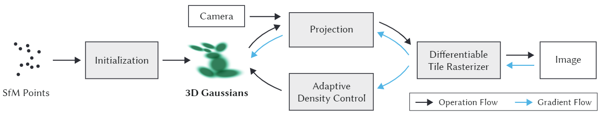

上图为整个系统的示意图，系统首先对SfM点云进行初始化，得到3D高斯，然后借助相机外参将点投影到图像平面上（即Splatting)，接着用可微光栅化，渲染得到图像。得到渲染图像Image后，将其与Ground Truth图像比较求Ioss，并沿蓝色箭头反向传播。蓝色箭头向上，更新3D高斯中的参数，向下送入自适应密度控制中，更新点云。

## 相关工作

#### 自己的数据集测试效果

- 某个未拍摄角度的渲染效果（使用colmap根据格式构建数据集）

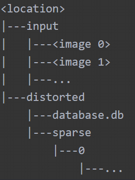

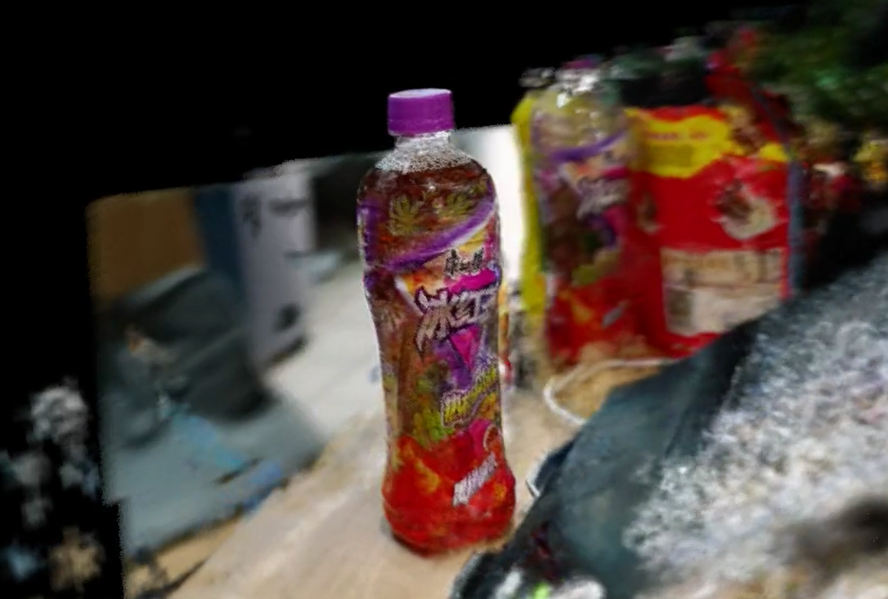

#### 使用去模糊模型对模糊图片输入后，再使用高斯模型处理

- 直接将模糊图像放入高斯模型，发现训练次数越多越模糊。

- 这种方法不符合3D一致性，而且效果在单张图片中比较明显，但训练出的模型效果并不好。

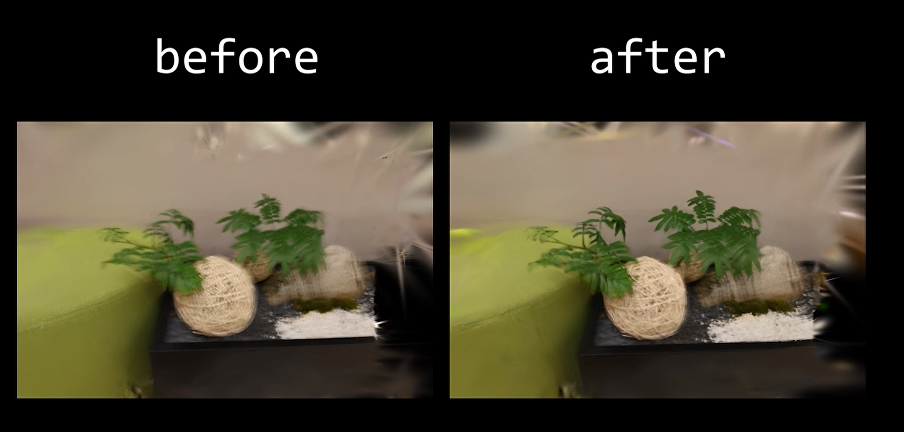

#### 模仿Deblur NeRF 的去模糊思路

- 流程图

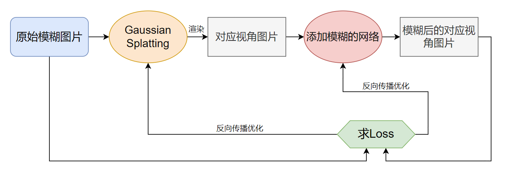

由于单独对图像做去模糊无法保证3D一致性，而NeRF模型以及Gaussian Splatting模型具有3D一致性，所以将模糊网络与高斯网络一起训练，模糊网络模拟学习模糊的过程，同时由于共享一个loss，也能给高斯模型添加去模糊的功能。最终，训练结束后，去除模糊网络，单独的高斯模型便实现了去模糊的功能，同时满足了3D一致性的要求。

- DeblurGAN

我在网上寻找合适的添加模糊的模型，发现 DeblurGAN 使用生成器与判别器联合优化，其中生成器的作用就是添加模糊，于是我便使用了它生成器的代码，添加在代码中。

```python
class ResBlock(nn.Module):
    def __init__(self, inc):
        super(ResBlock, self).__init__()
        block = [nn.Conv2d(inc, inc, 3, 1, 1, bias=False),
                nn.InstanceNorm2d(inc),
                nn.ReLU()]
        self.net = nn.Sequential(*block)        

    def forward(self, x):
        return x + self.net(x)
class Generator(nn.Module):
    def __init__(self):
        super(Generator, self).__init__()
        # n64
        model = [nn.Conv2d(3, 64, 7, 1, 3),
                 nn.InstanceNorm2d(64),
                 nn.ReLU(True)]
        # n128s2 + n256s2
        model += [nn.Conv2d(64, 128, 3, 2, 1, bias=False),
                  nn.InstanceNorm2d(128),
                  nn.ReLU(),
                  nn.Conv2d(128, 256, 3, 2, 1, bias=False),
                  nn.InstanceNorm2d(256),
                  nn.ReLU()]
        # 9 resblocks
        for _ in range(9):
            model += [ResBlock(256)]

        # n128s2 + n64s2
        model += [nn.ConvTranspose2d(256, 128, 3, 2, 1, output_padding=1, bias=False),
                  nn.InstanceNorm2d(128),
                  nn.ReLU(),
                  nn.ConvTranspose2d(128, 64, 3, 2, 1, output_padding=1, bias=False),
                  nn.InstanceNorm2d(64),
                  nn.ReLU()]
        # n64
        model += [nn.Conv2d(64, 3, 7, 1, 3),
                  nn.Tanh()]
        self.model = nn.Sequential(*model)
    def forward(self, x):
        out = x + self.model(x)
        out = torch.clamp(out, -1, 1)
        return out
```

```python
# add ----------------------------------
    blur = Generator().to(args.data_device)
    optimizer_b = optim.Adam(blur.parameters(), lr=0.01)
# add ----------------------------------

# add ----------------------------------
    image = image.unsqueeze(0)
    image = blur(image)
    image = image.squeeze(0)
# add ----------------------------------
    Ll1 = l1_loss(image, gt_image)
    loss = (1.0 - opt.lambda_dssim) * Ll1 + opt.lambda_dssim * (1.0 - ssim(image, gt_image))
    loss.backward()
    
# Optimizer step
    if iteration < opt.iterations:
        gaussians.optimizer.step()
        gaussians.optimizer.zero_grad(set_to_none = True)
        # add ----------------------------------
        optimizer_b.step()
        optimizer_b.zero_grad(set_to_none=True)
        # add ----------------------------------
```

加完后发现代码无法运行，显示维度出现了错误，最终在修改为指定大小以及升维降维后才成功运行，但效果并不好，有很多噪点且并不清晰。

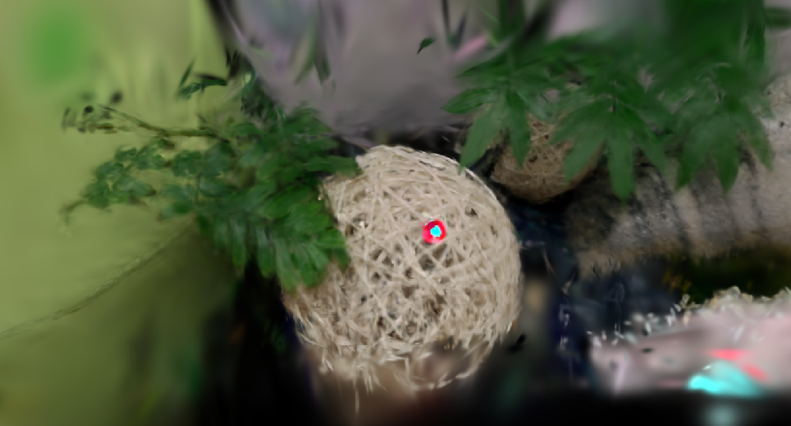

```python
# Loss
gt_image = viewpoint_cam.original_image.cuda()
        
width, high, channel = image.shape
width_new, high_new = (256, 256)
image= image[width-width_new:, (high-256)//2:high-((high-256)//2),:]
gt_image=gt_image[width-width_new:, (high-256)//2:high-((high-256)//2),:]
        
# add ----------------------------------
image = image.unsqueeze(0)
image = blur(image)
image = image.squeeze(0)
# add ----------------------------------
Ll1 = l1_loss(image, gt_image)
loss = (1.0 - opt.lambda_dssim) * Ll1 + opt.lambda_dssim * (1.0 - ssim(image, gt_image))
loss.backward()
```

- Zero-Shot Noise2Noise: Efficient Image Denoising without any Data

虽然它是一个去模糊的模型，但由于它比较小，且有一定的解释性，所以我也尝试了一下。

```python
class net(nn.Module):
    def __init__(self,n_chan,chan_embed=48):
        super(net, self).__init__()
        
        self.act = nn.LeakyReLU(negative_slope=0.2, inplace=True)
        self.conv1 = nn.Conv2d(n_chan,chan_embed,3,padding=1)
        self.conv2 = nn.Conv2d(chan_embed, chan_embed, 3, padding = 1)
        self.conv3 = nn.Conv2d(chan_embed, n_chan, 1)

    def forward(self, x):
        x = self.act(self.conv1(x))
        x = self.act(self.conv2(x))
        x = self.conv3(x)
        
        return x
```

得到的效果如下：


<br/>

- 自己设计的网络

我也尝试了自己设计的模糊网络，如下：

```python
class SimpleGenerator2(nn.Module):
    def __init__(self, input_nc=3, output_nc=3, kernel_size=7, sigma=1.0):
        super(SimpleGenerator2, self).__init__()

        # 计算填充以保持相同的空间尺寸
        padding = int((kernel_size - 1) / 2)

        # 使用具有模糊核的卷积层定义模型
        self.model = nn.Sequential(
            nn.ReflectionPad2d(padding),
            nn.Conv2d(input_nc, output_nc, kernel_size=kernel_size, padding=0),
            nn.Tanh()
        )

        # 为高斯核创建可学习的参数
        self.kernel = nn.Parameter(self.create_gaussian_kernel(kernel_size, sigma), requires_grad=True)

    def forward(self, input):
        # 在前向传播中使用可学习的高斯核作为卷积层的权重
        self.model[1].weight.data[0, 0, :, :] = self.kernel
        return self.model(input)

    def create_gaussian_kernel(self, kernel_size, sigma):
        """
        创建一个二维高斯核。
        """
        kernel_size = int(kernel_size)
        sigma = float(sigma)

        # 确保核大小为奇数
        if kernel_size % 2 == 0:
            kernel_size += 1

        # 创建一维高斯核
        coords = torch.arange(kernel_size, dtype=torch.float32)
        coords -= (kernel_size - 1) / 2.0
        kernel = torch.exp(-(coords ** 2) / (2 * sigma ** 2))
        kernel /= kernel.sum()

        # 将一维核转换为二维核
        kernel = kernel.view(1, 1, -1, 1) * kernel.view(1, 1, 1, -1)

        return kernel
```

同时对学习率进行了设置

```python
# add ----------------------------------
        if iteration < 500:
            optimizer_b.param_groups[0]['lr'] = 0.01
        elif iteration >= 500 and iteration <2000:
            optimizer_b.param_groups[0]['lr'] = 0.005
        else:
            optimizer_b.param_groups[0]['lr'] = 0.001
# add ----------------------------------
```

得到了相对较好的结果如下：

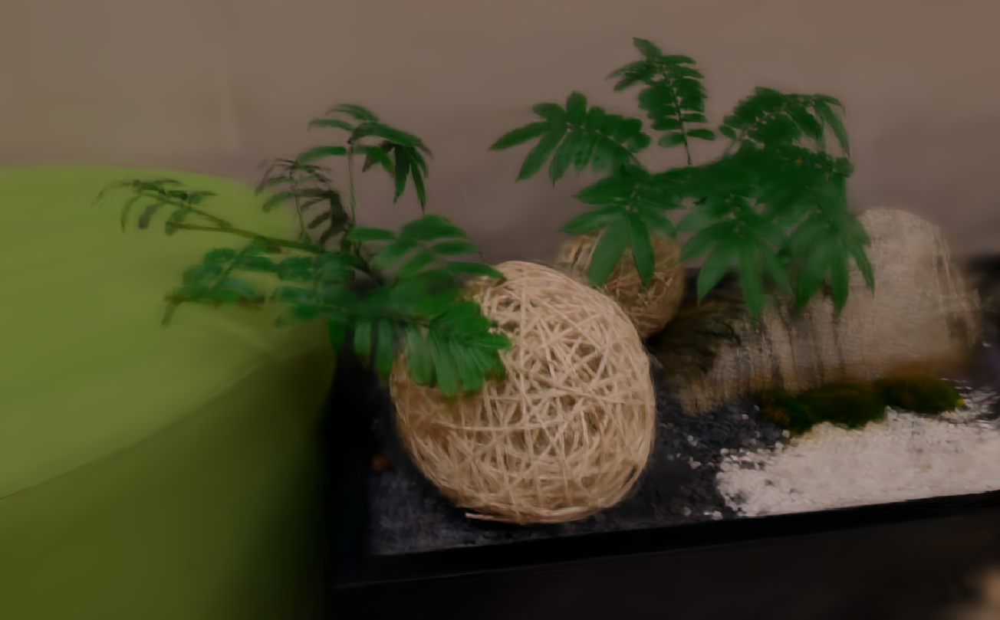

#### 结果展示

经过对各种超参数的尝试性调整，得到了相对最清晰的结果，如下图左边所示，右边为gt：

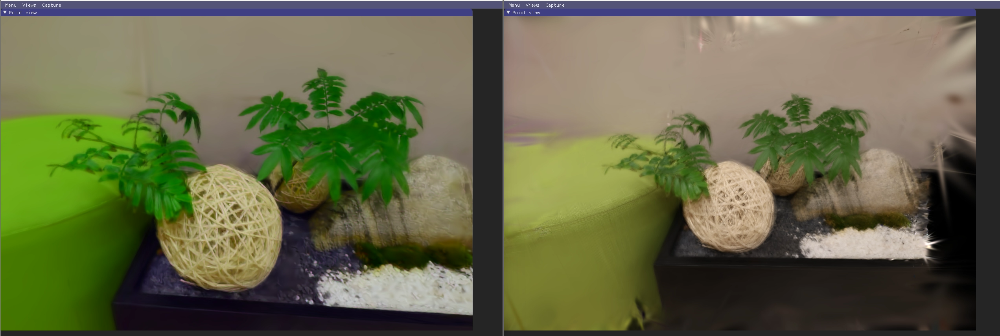

但它也有不少缺陷，包括颜色的改变等。

## 附录

以下是代码学习的相关过程，主要是通过调试train.py的过程来熟悉相关的代码。

- 运行结果


#### train.py

```sh
python train.py -s ./data/... -m ./output/...
```

- 从 `train.py` 的主函数开始
- 创建 `parser` ，传入`parser`作为参数，使用函数创建三个实例，然后给parser添加相关参数（`op`截图不完整）（rotation 旋转）

```python
lp = ModelParams(parser)
op = OptimizationParams(parser)
pp = PipelineParams(parser) # 至少两项是对照组选项

parser.add_argument('--ip', type=str, default="127.0.0.1")
...
```


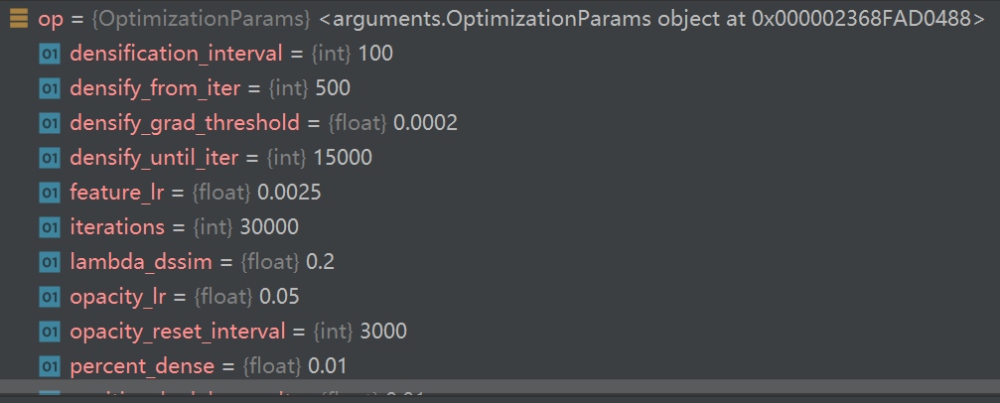

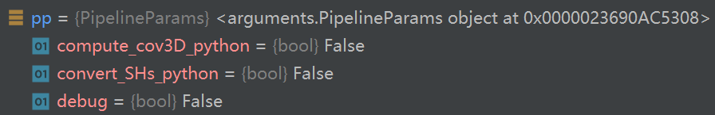

- 解析参数，传入`args`变量

```python
args = parser.parse_args(sys.argv[1:])
```

- 开启 GUI 服务器

```python
network_gui.init(args.ip, args.port)

# network_gui.py
def init(wish_host, wish_port):
    global host, port, listener
    host = wish_host
    port = wish_port
    listener.bind((host, port))
    listener.listen()
    listener.settimeout(0)
```

- 将`args.detect_anomaly`的值设置为自动梯度异常检测功能的状态

```python
torch.autograd.set_detect_anomaly(args.detect_anomaly)
```

- 开始训练

```python
training(lp.extract(args), op.extract(args), pp.extract(args), 
args.test_iterations, args.save_iterations, args.checkpoint_iterations, 
args.start_checkpoint, args.debug_from)
```

（训练结束后，输出 `print("\nTraining complete.")`，`train.py`全部结束）

调用 `train` 函数

- 准备tensorboard记录

```python
tb_writer = prepare_output_and_logger(dataset)
```

- 创建高斯模型对象

```python
gaussians = GaussianModel(dataset.sh_degree)

# 进入gaussian_model.py
self.max_sh_degree = sh_degree  # 该model的__init__函数中
# 退出
```

- 初始化场景对象

```python
scene = Scene(dataset, gaussians)

# Scene类定义在 __init__.py 中
```

进入 `__init__.py` 

- 读取colmap数据（sparse等）
- 将 points3D.ply 复制给 input.ply
- 将场景的camera数据存入列表，并遍历列表，依次将相机对象转换为json格式保存在json_cams列表中（数据集照片的数量就是camera列表的长度），并将其保存在camera.json中
- 保证多分辨率一致性的情况下对cameras进行shuffle
- 从场景信息中获取相机视野范围

```python
self.cameras_extent = scene_info.nerf_normalization["radius"]
# radius 视野范围的半径
```

- 将场景中点云信息转化为高斯分布（pcd是点云对象）

```python
self.gaussians.create_from_pcd(scene_info.point_cloud, self.cameras_extent)
```

进入 `gaussian_model.py`

```python
def create_from_pcd(self, pcd:BasicPointCloud, spatial_lr_scale:float):
  ...
  # 将点云的颜色从RGB转换为SH（色相、饱和度和明度）
  fused_color = RGB2SH(torch.tensor(np.asarray(pcd.colors)).float().cuda())
  # 初始化一个形状为(fused_color.shape[0], 3, (self.max_sh_degree + 1) ** 2)
  # 的特征张量，并将颜色设置为第一层。
  features = torch.zeros((fused_color.shape[0], 3, (self.max_sh_degree + 1) ** 2)).float().cuda()
  features[:, :3, 0 ] = fused_color
  features[:, 3:, 1:] = 0.0
  
  ...
  # 计算点云中每个点到原点的距离的平方（dist2）
  # 计算点到原点的尺度（scales），并将其转换为log空间
  # 初始化旋转矩阵（rots）不透明度（opacities）
  # 将点云的坐标、特征等设置为nn.Parameter，以便在训练过程中进行梯度更新
  # 初始化max_radii2D
```

退出 `gaussian_model.py`

退出 `__init.py` 

回到 `train` 函数中

- 设置训练过程中的参数，如学习率、优化器等。

```python
gaussians.training_setup(opt)

# 进入gaussian_model.py
# 调用 training_setup 函数
...
# 创建一个优化器，参数列表为l(l是学习率列表)，学习率为0.0，小批量梯度平方的衰减率为1e-15。
self.optimizer = torch.optim.Adam(l, lr=0.0, eps=1e-15)

# 定义一个学习率调度器，用于训练过程中逐步增加学习率
self.xyz_scheduler_args = get_expon_lr_func(lr_init=training_args.position_lr_init*self.spatial_lr_scale,
                                                    lr_final=training_args.position_lr_final*self.spatial_lr_scale,
                                                    lr_delay_mult=training_args.position_lr_delay_mult,
                                                    max_steps=training_args.position_lr_max_steps)
# 退出 gaussian_model.py
```

- 设置计算训练时间消耗
- 定义损失变量 `ema_loss_for_log` 
- 设置tqdm
- 开始迭代

```python
for iteration in range(first_iter, opt.iterations + 1):
```

- Every 1000 its we increase the levels of SH up to a maximum degree
- 随机选一个 camera 给 viewpoint_cam
- 开始 render

```python
render_pkg = render(viewpoint_cam, gaussians, pipe, bg)
image, viewspace_point_tensor, visibility_filter, radii = render_pkg["render"], render_pkg["viewspace_points"], render_pkg["visibility_filter"], render_pkg["radii"]
```

进入 `gaussian_renderer\__init__.py`

- 创建一个零张量，这个张量将用于记录2D屏幕空间点（screen-space points）的梯度
- 设置透视投影的配置
- 设置光栅化配置

```python
raster_settings = GaussianRasterizationSettings(
        image_height=int(viewpoint_camera.image_height),
        image_width=int(viewpoint_camera.image_width),
        tanfovx=tanfovx,
        tanfovy=tanfovy,
        bg=bg_color,
        scale_modifier=scaling_modifier, #缩放因子
        # 视点摄像机在世界坐标系下的 viewing matrix（视图矩阵）
        viewmatrix=viewpoint_camera.world_view_transform,
        # 视点摄像机在投影矩阵下的投影矩阵
        projmatrix=viewpoint_camera.full_proj_transform,
        sh_degree=pc.active_sh_degree, # 高斯模糊的指数
        campos=viewpoint_camera.camera_center, # 摄像机中心的位置
        prefiltered=False, # 是否预过滤
        debug=pipe.debug # false
    )
```

- 创建一个高斯光栅化器

```python
rasterizer = GaussianRasterizer(raster_settings=raster_settings)
```

- 分别从点云对象pc中获取xyz坐标、屏幕空间坐标和透明度信息，并将这些信息分别存储在means3D、means2D和opacity变量中。
- 初始化三个变量：scales、rotations和cov3D_precomp
- 初始化或设置三个变量：shs、colors_precomp和override_color

```python
...(if else 判断后选择)
shs = pc.get_features
```

- 使用光栅化（rasterizer）将可见的高斯分布绘制到图像中，并获取它们的半径（在屏幕上）(shs和colors_precomp是互斥的)
- 返回了一个字典，其中包含了四个键值对：render：渲染后的图像; viewspace_points：视空间点（在摄像机视口坐标系下的点); visibility_filter：可见性过滤器，用于过滤出可见的点云; radii：半径向量，表示每个点云在屏幕上的半径大小。

退出 `gaussian_renderer\__init__.py` 

回到 `train` 函数中

- image 和 gt_image 求L1 Loss
- 加上SSIM损失
- 反向传播

```python
gt_image = viewpoint_cam.original_image.cuda()
Ll1 = l1_loss(image, gt_image)
loss = (1.0 - opt.lambda_dssim) * Ll1 + opt.lambda_dssim * (1.0 - ssim(image, gt_image))
loss.backward()
# lambda_dssim是个超参数，第一轮时是0.2
# 控制了第一部分损失（Ll1损失）和第二部分损失（SSIM损失）的权重。
```

- 取消梯度计算（通常当验证或测试阶段）

```python
with torch.no_grad():
```

- 计算损失（loss）的指数移动平均值（EMA），每十轮打印，作为该时刻的Loss

```python
ema_loss_for_log = 0.4 * loss.item() + 0.6 * ema_loss_for_log
```

- 更新 Progress bar
- 保存 log
- Densification 操作。密集化是一种在训练过程中，通过增加高斯点云的密度，从而提高模型性能的技术。
- 在迭代次数小于 densify_until_iter 时，更新 gaussians 信息
- 同时大于 densify_from_iter 且 `iteration % opt.densification_interval==0`，则进行 densification 操作
- 进行密集化和剪枝：使用指定的梯度阈值（opt.densify_grad_threshold，默认为0.0002）和透明度阈值（0.005）进行密集化和剪枝操作，同时使用场景中摄像机的位置和视野范围作为剪枝的尺寸阈值（scene.cameras_extent）

```python
size_threshold = 20 if iteration > opt.opacity_reset_interval else None
gaussians.densify_and_prune(opt.densify_grad_threshold, 0.005, scene.cameras_extent, size_threshold)
```

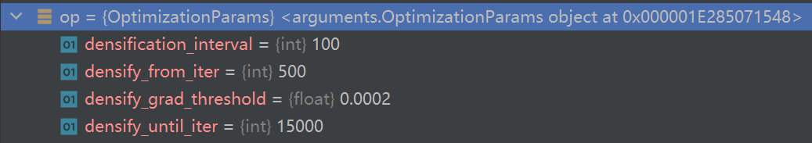

进入 `gaussian_model.py`

```python
    def densify_and_prune(self, max_grad, min_opacity, extent, max_screen_size):
        grads = self.xyz_gradient_accum / self.denom
        grads[grads.isnan()] = 0.0

        # 根据梯度分别处理
        self.densify_and_clone(grads, max_grad, extent)
        self.densify_and_split(grads, max_grad, extent)

        prune_mask = (self.get_opacity < min_opacity).squeeze()
        if max_screen_size:
            big_points_vs = self.max_radii2D > max_screen_size
            big_points_ws = self.get_scaling.max(dim=1).values > 0.1 * extent
            prune_mask = torch.logical_or(torch.logical_or(prune_mask, big_points_vs), big_points_ws)
        # 根据透明度阈值和高斯点云的大小阈值，筛选出需要剪枝的点云
        self.prune_points(prune_mask)

        torch.cuda.empty_cache()
```

退出 `gaussian_model.py`

回到 `train` 函数中

- 优化器更新参数
- 将高斯点云的梯度清零，以准备进行下一轮迭代

```python
gaussians.optimizer.step()
gaussians.optimizer.zero_grad(set_to_none = True)
```

- 一轮训练结束
- 进行30000轮训练


## 参考文献

【1】Kerbl, Bernhard, et al. 3D Gaussian Splatting for Real-Time Radiance Field Rendering. Aug. 2023.

【2】Mansour, Youssef, and Reinhard Heckel. Zero-Shot Noise2Noise: Efficient Image Denoising without Any Data. Mar. 2023.

【3】Kupyn, Orest, et al. “DeblurGAN-v2: Deblurring (Orders-of-Magnitude) Faster and Better.” 2019 IEEE/CVF International Conference on Computer Vision (ICCV), 2019, https://doi.org/10.1109/iccv.2019.00897.

【4】Müller, Thomas, et al. “Instant Neural Graphics Primitives with a Multiresolution Hash Encoding.” ACM Transactions on Graphics, July 2022, pp. 1–15, https://doi.org/10.1145/3528223.3530127.

【5】Ma, Li, et al. “Deblur-NeRF: Neural Radiance Fields from Blurry Images.” Cornell University - arXiv,Cornell University - arXiv, Nov. 2021.
