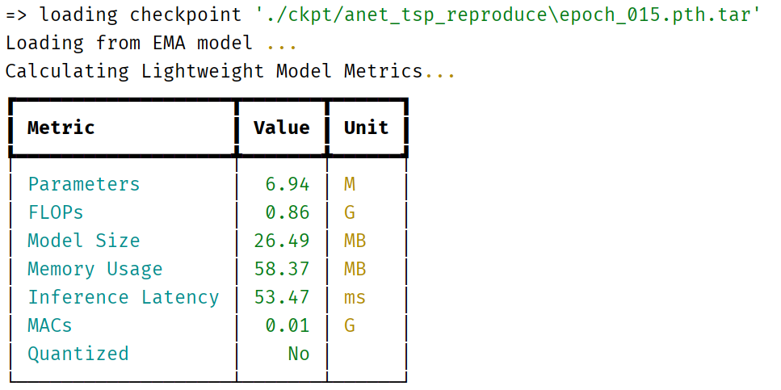

# 实验记录及截图

- 运行 `CUDA_VISIBLE_DEVICES=0 python train.py ./configs/thumos_i3d.yaml --output output`​

​

​

​


​

​

- 运行`CUDA_VISIBLE_DEVICES=0 python eval.py ./configs/thumos_i3d.yaml ./ckpt/thumos_i3d_output/`​


尝试`python visual.py ./configs/thumos_i3d.yaml ./ckpt/thumos_i3d_output`​（失败）

- 运行 `CUDA_VISIBLE_DEVICES=0 python train.py ./configs/anet_tsp.yaml --output output`​

​

- 运行 `python eval.py ./configs/anet_tsp.yaml ./ckpt/anet_tsp_output/`​

​

​

​`zip -r anet_tsp_output.zip ./anet_tsp_output/`​ 注意需要 `-r`​

- 本地3060运行 `python train.py ./configs/thumos_i3d_1.yaml --output output1`​

​

```bash
Traceback (most recent call last):
  File "<string>", line 1, in <module>
Traceback (most recent call last):
  File "train.py", line 220, in <module>
    main(args)
  File "train.py", line 167, in main
    print_freq=args.print_freq)
  File "D:\Code\PyCharm\DyFADet-pytorch-main\libs\utils\train_utils.py", line 392, in valid_one_epoch
  File "D:\Downloads\MyApp\Anaconda\envs\mypytorch\lib\multiprocessing\spawn.py", line 105, in spawn_main
    for iter_idx, video_list in enumerate(val_loader, 0):
  File "D:\Downloads\MyApp\Anaconda\envs\mypytorch\lib\site-packages\torch\utils\data\dataloader.py", line 363, in __iter__
    exitcode = _main(fd)
  File "D:\Downloads\MyApp\Anaconda\envs\mypytorch\lib\multiprocessing\spawn.py", line 114, in _main
    prepare(preparation_data)
  File "D:\Downloads\MyApp\Anaconda\envs\mypytorch\lib\multiprocessing\spawn.py", line 225, in prepare
    _fixup_main_from_path(data['init_main_from_path'])
  File "D:\Downloads\MyApp\Anaconda\envs\mypytorch\lib\multiprocessing\spawn.py", line 277, in _fixup_main_from_path
    self._iterator = self._get_iterator()
  File "D:\Downloads\MyApp\Anaconda\envs\mypytorch\lib\site-packages\torch\utils\data\dataloader.py", line 314, in _get_iterator
    run_name="__mp_main__")
  File "D:\Downloads\MyApp\Anaconda\envs\mypytorch\lib\runpy.py", line 263, in run_path
    return _MultiProcessingDataLoaderIter(self)
  File "D:\Downloads\MyApp\Anaconda\envs\mypytorch\lib\site-packages\torch\utils\data\dataloader.py", line 927, in __init__
    w.start()
  File "D:\Downloads\MyApp\Anaconda\envs\mypytorch\lib\multiprocessing\process.py", line 112, in start
    pkg_name=pkg_name, script_name=fname)
  File "D:\Downloads\MyApp\Anaconda\envs\mypytorch\lib\runpy.py", line 96, in _run_module_code
    self._popen = self._Popen(self)
  File "D:\Downloads\MyApp\Anaconda\envs\mypytorch\lib\multiprocessing\context.py", line 223, in _Popen
    mod_name, mod_spec, pkg_name, script_name)
  File "D:\Downloads\MyApp\Anaconda\envs\mypytorch\lib\runpy.py", line 85, in _run_code
    exec(code, run_globals)
  File "D:\Code\PyCharm\DyFADet-pytorch-main\train.py", line 9, in <module>
    import torch
  File "D:\Downloads\MyApp\Anaconda\envs\mypytorch\lib\site-packages\torch\__init__.py", line 126, in <module>
    return _default_context.get_context().Process._Popen(process_obj)
  File "D:\Downloads\MyApp\Anaconda\envs\mypytorch\lib\multiprocessing\context.py", line 322, in _Popen
    raise err
OSError: [WinError 1455] 页面文件太小，无法完成操作。 Error loading "D:\Downloads\MyApp\Anaconda\envs\mypytorch\lib\site-packages\torch\lib\shm.dll" or one of its dependencies.
    return Popen(process_obj)
  File "D:\Downloads\MyApp\Anaconda\envs\mypytorch\lib\multiprocessing\popen_spawn_win32.py", line 89, in __init__
    reduction.dump(process_obj, to_child)
  File "D:\Downloads\MyApp\Anaconda\envs\mypytorch\lib\multiprocessing\reduction.py", line 60, in dump
    ForkingPickler(file, protocol).dump(obj)
BrokenPipeError: [Errno 32] Broken pipe
```

- 解决方案：给d盘加虚拟内存  [`成功解决OSError: [WinError 1455] 页面文件太小，无法完成操作`](https://blog.csdn.net/m0_62919535/article/details/132725967)​

​

- 本地运行 `python eval.py ./configs/thumos_i3d.yaml ./ckpt/thumos_i3d_output/`​


（ eval成功运行了，但train还是无法运行）

- 本地跑通了10个epoch的，但是mAP很低 `python train.py ./configs/thumos_i3d_1.yaml --output output1`​

​

- 本地运行 `python train.py ./configs/thumos_i3d.yaml --output output1`​

​

​

- 本地运行 `python eval.py ./configs/anet_tsp.yaml ./ckpt/anet_tsp_output/`​

​

- 本地运行 `D:\Downloads\MyApp\Anaconda\envs\mypytorch\python.exe D:/Code/PyCharm/DyFADet-pytorch-main/eval.py ./configs/thumos_i3d.yaml ./ckpt/thumos_i3d_output1/`​

  ​

  ​
- ​`python eval.py ./configs/anet_tsp.yaml ./ckpt/anet_tsp_output/`​

  
- 计算mAP部分

  ​

  ​

  ​

  ​
- 本地运行 `python train.py ./configs/thumos_i3d.yaml --output test1`​

  1. ​`libs/core/config.py`​ 文件的主要功能是定义并加载模型训练和评估所需的配置参数。它提供了默认配置，支持从外部配置文件加载参数，并将默认配置与外部配置进行合并和更新。

      这里我将原始的`num_workers`​从4改成了1

      ​
  2. 在深度学习中，优化器的主要作用是根据模型在训练数据上的损失函数值，调整模型的参数，以最小化损失函数，从而提高模型的性能。在 `DyFADet - pytorch`​ 项目里，`make_optimizer`​ 函数承担了创建优化器的任务
  3. ​`scheduler = make_scheduler(optimizer, cfg['opt'], num_iters_per_epoch)`​ 这行代码的作用是根据优化器、优化器配置信息以及每个 epoch 的迭代次数来创建一个学习率调度器（scheduler）。学习率调度器的主要功能是在训练过程中动态地调整学习率，以帮助模型更好地收敛。
- 本地运行 `ActionFormer`​  `python ./train.py ./configs/thumos_i3d.yaml --output reproduce`​

  1. 这里是 `5+30`​轮训练
  2. ​`python ./eval.py ./configs/thumos_i3d.yaml ./ckpt/thumos_i3d_reproduce`​

      ​

      ​
  3. ​`python ./eval.py ./configs/anet_tsp.yaml ./ckpt/anet_tsp_reproduce`​

      ​

      ​
- 本地运行 `tridet`​

  1. ​`thumos14`​ `num_workers=4`​

      ​
- ​`thumos_i3d_01.yaml`​ 消融实验 `backbone_type: 'conv',`​ `62.04%`​

  ​

  ​
- ​`thumos_i3d_02.yaml`​ 消融实验 `backbone_type: 'conv',dyn_head_flag: False,`​

  ​

  ​
- ​`thumos_i3d_03.yaml`​ `DynE+False`​

  ​

  ​
- ​`train.py ./configs/anet_tsp_03.yaml --output abl_output03`​ 消融实验 `DynE+False`​

  ​

  ​`eval`​

  ​

  ​

‍
