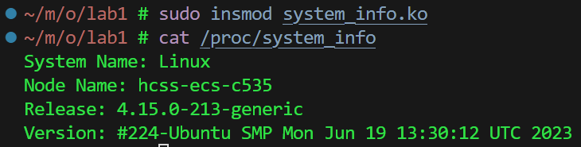
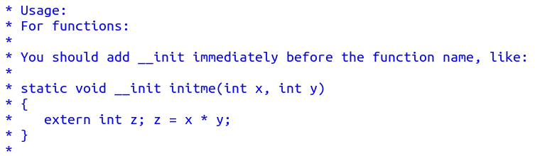

## 实验内容

#### 实验要求

设计一个内核模块，其功能是显示当前系统的名称和版本信息。

#### 流程

- 创建 $system\_{}info.c$

```c_cpp
#include <linux/seq_file.h>
#include <linux/proc_fs.h>
#include <linux/module.h>
#include <linux/proc_fs.h>
#include <linux/utsname.h>
#include <linux/kernel.h>

MODULE_LICENSE("GPL");
MODULE_AUTHOR("Your Name");
MODULE_DESCRIPTION("System Info Module");

static struct proc_dir_entry *proc_entry;

static int system_info_show(struct seq_file *m, void *v)
{
    struct new_utsname *uts;
    uts = utsname();

    seq_printf(m, "System Name: %s\n", uts->sysname);
    seq_printf(m, "Node Name: %s\n", uts->nodename);
    seq_printf(m, "Release: %s\n", uts->release);
    seq_printf(m, "Version: %s\n", uts->version);

    return 0;
}

static int system_info_open(struct inode *inode, struct file *file)
{
    return single_open(file, system_info_show, NULL);
}

static const struct file_operations system_info_file_ops = {
    .owner = THIS_MODULE,
    .open = system_info_open,
    .read = seq_read,
    .llseek = seq_lseek,
    .release = single_release,
};

static int __init system_info_init(void)
{
    proc_entry = proc_create("system_info", 0444, NULL, &system_info_file_ops);
    if (!proc_entry)
    {
        printk(KERN_ERR "Failed to create /proc/system_info\n");
        return -ENOMEM;
    }
    printk(KERN_INFO "System Info module loaded\n");
    return 0;
}
static void __exit system_info_exit(void)
{
    remove_proc_entry("system_info", NULL);
    printk(KERN_INFO "System Info module unloaded\n");
}

module_init(system_info_init);
module_exit(system_info_exit);
```

- 创建$Makefile$

```sh
CFLAGS_system_info.o := -I$(src)

obj-m += system_info.o

all:
	make -C /lib/modules/$(shell uname -r)/build M=$(PWD) modules

clean:
	make -C /lib/modules/$(shell uname -r)/build M=$(PWD) clean
```

- 添加模块

```sh
make
```

- 测试

```sh
sudo insmod system_info.ko
cat /proc/system_info
```



- 退出

```sh
sudo rmmod system_info.ko
```

## 分析

- Makefile

```sh
CFLAGS_system_info.o := -I$(src)

# 定义了一个变量CFLAGS_system_info.o，它的值是-I$(src)
# 该变量是一个编译器参数，用于指定编译时使用的头文件路径
# $(src)是一个Makefile变量，它的值是src目录的路径
```

```sh
obj-m += system_info.o

# 将system_info.o目标添加到obj-m变量中，使得在构建时能够为目标文件添加相应的编译参数。
# system_info.o是一个目标文件，它的作用是提供系统信息
# obj-m是一个Makefile变量，用于存储构建目标（即.o文件）的名称
```

```sh
all:
	make -C /lib/modules/$(shell uname -r)/build M=$(PWD) modules

clean:
	make -C /lib/modules/$(shell uname -r)/build M=$(PWD) clean
	
# 定义两个规则，make all 和 make clean
```

- $system\_{}info.c$

```c_cpp
#include <linux/seq_file.h>
#include <linux/proc_fs.h>
#include <linux/module.h>
#include <linux/proc_fs.h>
#include <linux/utsname.h>
#include <linux/kernel.h>
// 这些头文件包含需要使用的内核函数和数据结构的声明。
```

```c_cpp
MODULE_LICENSE("GPL");
MODULE_AUTHOR("Your Name");
MODULE_DESCRIPTION("System Info Module");
// 这些宏提供了关于内核模块的基本信息，如许可证、作者和描述。
```

```c_cpp
static struct proc_dir_entry *proc_entry;

/*--------------------------------------------*/

// proc_dir_entry是一个表示系统进程目录条目（目录项）的结构
// 进程目录条目表示了系统中所有进程的信息，包括它们的名称、状态、进程组、打开的文件描述符等。
// 进程目录条目通常存储在/proc目录中，每个进程在/proc目录下都有一个以进程ID命名的目录

// proc_dir_entry 定义在 proc_fs.h 

// 以下为 proc_fs.h
struct proc_dir_entry;
```

```c_cpp
static int system_info_show(struct seq_file *m, void *v)
{
    struct new_utsname *uts;
    uts = utsname();

    seq_printf(m, "System Name: %s\n", uts->sysname);
    seq_printf(m, "Node Name: %s\n", uts->nodename);
    seq_printf(m, "Release: %s\n", uts->release);
    seq_printf(m, "Version: %s\n", uts->version);

    return 0;
}
// 用于在seq_file中输出系统信息，包括系统名称、节点名称、版本和发布信息
// seq_file 在 fs.h 中定义了结构体

/*--------------------------------------------*/

// 有关于utsname() 和 new_utsname
// include/linux/utsname.h
static inline struct new_utsname *utsname(void)
{
	return &current->nsproxy->uts_ns->name;
}
// include/linux/nsproxy.h
struct nsproxy {
	atomic_t count;
	struct uts_namespace *uts_ns;
	struct ipc_namespace *ipc_ns;
	struct mnt_namespace *mnt_ns;
	struct pid_namespace *pid_ns_for_children;
	struct net 	     *net_ns;
	struct cgroup_namespace *cgroup_ns;
};
extern struct nsproxy init_nsproxy;
// uapi/linux/utsname.h
struct new_utsname {
	char sysname[__NEW_UTS_LEN + 1];
	char nodename[__NEW_UTS_LEN + 1];
	char release[__NEW_UTS_LEN + 1];
	char version[__NEW_UTS_LEN + 1];
	char machine[__NEW_UTS_LEN + 1];
	char domainname[__NEW_UTS_LEN + 1];
};

// 有关于current
// include/asm-generic/current.h
#include <linux/thread_info.h>
#define get_current() (current_thread_info()->task) // 获取当前进程的线程task
#define current get_current()
// arch/arm/include/asm/thread_info.h
/*
 * how to get the thread information struct from C
 */
register unsigned long current_stack_pointer asm ("sp");
// 使用 register 关键字声明了一个变量 current_stack_pointer，并将其与汇编寄存器 sp 绑定
...
static inline struct thread_info *current_thread_info(void) __attribute_const__;
static inline struct thread_info *current_thread_info(void)
{
	return (struct thread_info *)
		(current_stack_pointer & ~(THREAD_SIZE - 1));
  // 将 current_stack_pointer 的值向下对齐到 THREAD_SIZE 的整数倍
  // 这样可以确保获得堆栈的起始地址
}

// 关于seq
// include/linux/seq_file.h
struct seq_file {
	char *buf;
	size_t size;
	size_t from;
	size_t count;
	size_t pad_until;
	loff_t index;
	loff_t read_pos;
	u64 version;
	struct mutex lock;
	const struct seq_operations *op;
	int poll_event;
	const struct file *file;
	void *private;
};
...
void seq_printf(struct seq_file *m, const char *fmt, ...);
```

```c_cpp
static int system_info_open(struct inode *inode, struct file *file)
{
    return single_open(file, system_info_show, NULL);
}
// 这个函数在打开/proc/system_info文件时调用，并设置文件的读取操作
// 以便在用户读取该文件时调用system_info_show函数
// inode包含文件的元信息

/*--------------------------------------------*/

// 有关于 single_open
// include/linux/seq_file.h
int single_open(struct file *, int (*)(struct seq_file *, void *), void *);
```

```c_cpp
static const struct file_operations system_info_file_ops = {
    .owner = THIS_MODULE,
    .open = system_info_open,
    .read = seq_read,
    .llseek = seq_lseek,
    .release = single_release,
};
// 这个结构定义了文件操作函数的回调，包括打开、读取、查找和释放文件

/*--------------------------------------------*/

// include/linux/fs.h
struct file_operations {
  struct module *owner;
  loff_t (*llseek) (struct file *, loff_t, int);
  ssize_t (*read) (struct file *, char __user *, size_t, loff_t *);
  ...
  int (*open) (struct inode *, struct file *);
  ...
  int (*release) (struct inode *, struct file *);
}
// include/linux/seq_file.h
int single_release(struct inode *, struct file *);
```

```c_cpp
static int __init system_info_init(void)
{
    proc_entry = proc_create("system_info", 0444, NULL, &system_info_file_ops);
    if (!proc_entry)
    {
        printk(KERN_ERR "Failed to create /proc/system_info\n");
        return -ENOMEM;
    }
    printk(KERN_INFO "System Info module loaded\n");
    return 0;
}
static void __exit system_info_exit(void)
{
    remove_proc_entry("system_info", NULL);
    printk(KERN_INFO "System Info module unloaded\n");
}
// 分别用于模块的初始化和卸载
// 在初始化函数中，它创建了 /proc/system_info 文件，并在卸载函数中删除该文件

/*--------------------------------------------*/

// include/linux/init.h
#define __init		__section(.init.text) __cold  __latent_entropy __noinitretpoline
// __section(.init.text)：这个属性指定了由__init定义的代码应该放置在一个名为.init.text的特定区段中
// 区段是链接器在二进制文件中组织代码和数据的一种方式。

// proc_fs.h
struct proc_dir_entry *proc_create(const char *name, umode_t mode, struct proc_dir_entry *parent, const struct file_operations *proc_fops);
// 0444 0：常规文件 444：所有者、群组和其他用户都具有只读权限
// struct proc_dir_entry 是 Linux 内核中用于表示 proc 文件系统中的目录或文件节点的结构体
// KERN_ERR 表示错误级别 3
// KERN_INFO 表示信息级别 6
extern void remove_proc_entry(const char *, struct proc_dir_entry *);
```



```c_cpp
module_init(system_info_init);
module_exit(system_info_exit);
// 这些宏用于指定模块的初始化和卸载函数
```
