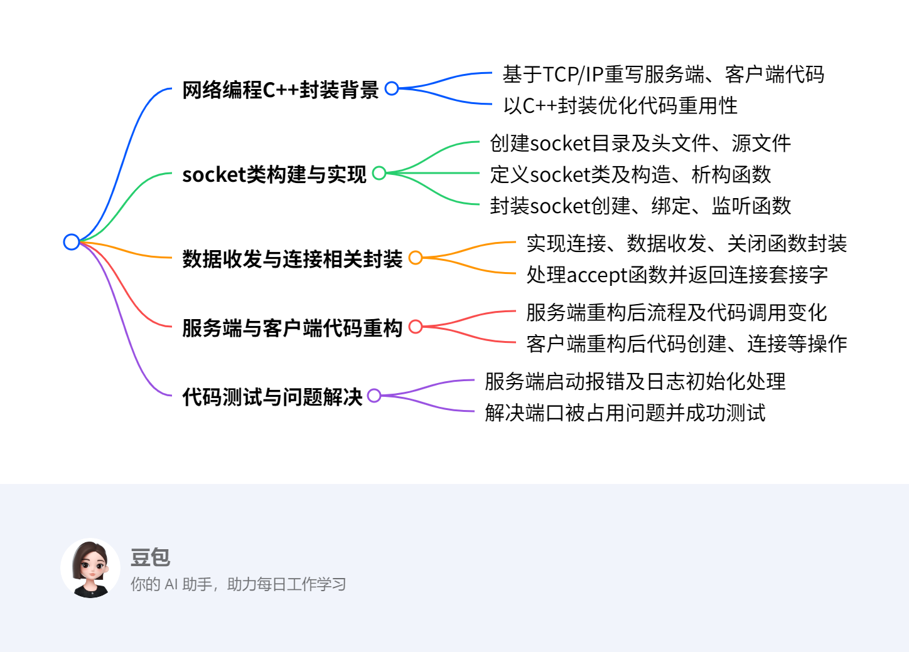
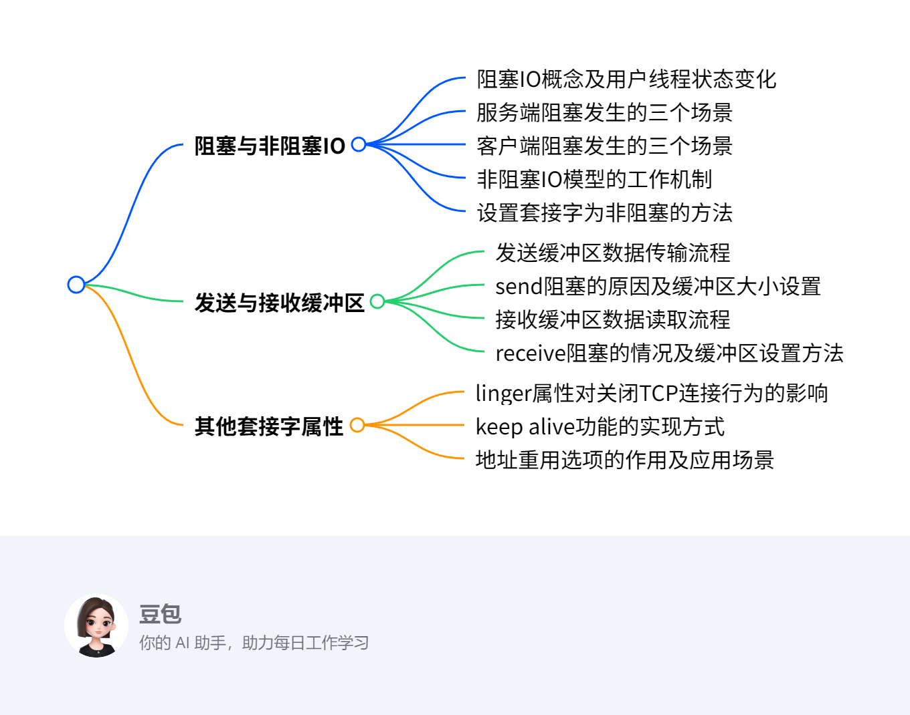
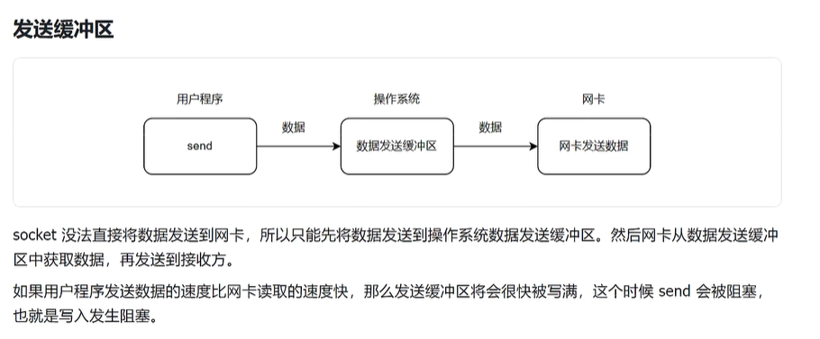

<style>
img{
    width: 60%;
    padding-left: 20%;
}
</style>
# 网络编程从零开始

[TCP/IP 网络编程从零开始](https://www.bilibili.com/video/BV1pu411G7P6/?spm_id_from=333.1007.top_right_bar_window_custom_collection.content.click&amp;vd_source=e98373b1a1167aa57cc8323787bb0ce6)

##### 1.1

​`4.22`​

1. ​
2. 进程间通信 IPC

    pipe：eg. `ps -ef | grep test`​

    socket允许远程通信

    ​
3. ​

##### 1.2

1. ​
2. ​`AF_INET`​是一个重要的常量，它属于地址族（Address Family）的一种标识。

    ​`AF_INET`​代表的是 IPv4（Internet Protocol version 4）地址族。
3. 网络地址编码统一采用大端
4. ```cpp
    #include <iostream>

    #include <sys/socket.h>
    #include <netinet/in.h>
    #include <cstring>
    #include <string>
    #include <arpa/inet.h>
    #include <unistd.h>

    using namespace std;

    int main()
    {
        // 1. create socket
        int sockfd = socket(AF_INET, SOCK_STREAM, IPPROTO_TCP);
        if (sockfd < 0)
        {
            cout << "create socket error: errno=" << errno << " errmsg=" << strerror(errno) << "\n";
            return 1;
        }
        else
            cout << "create socket success!\n";
        // 2. bind ip port
        string ip = "127.0.0.1";
        int port = 8080;
        struct sockaddr_in sockaddr;
        memset(&sockaddr, 0, sizeof(sockaddr));
        sockaddr.sin_family = AF_INET;
        sockaddr.sin_addr.s_addr = inet_addr(ip.c_str());
        sockaddr.sin_port = htons(port);
        if (bind(sockfd, (struct sockaddr *)&sockaddr, sizeof(sockaddr)) < 0)
        {
            cout << "socket bind error: errno=" << errno << " errmsg=" << strerror(errno) << "\n";
            return 1;
        }
        else
            cout << "socket bind success: ip=" << ip.c_str() << " port=" << port << "\n";
        // 3. listen socket
        if (listen(sockfd, 1024) < 0)
        {
            cout << "listen socket error: errno=" << errno << " errmsg=" << strerror(errno) << "\n";
        }
        else
            cout << "socket listening ...\n";
        // 4. receive client connect
        while (1)
        {
            int connfd = accept(sockfd, nullptr, nullptr);
            if (connfd < 0)
            {
                cout << "socket accept error: errno=" << errno << " errmsg=" << strerror(errno) << "\n";
                return 1;
            }
            else
                cout << "socket accept success\n";
            char buf[1024] = {0};
            // 5. receive client data
            size_t len = recv(connfd, buf, sizeof(buf), 0);
            cout << "recv: connfd=" << connfd << " msg=" << buf << "\n";
            // 6. send data to client
            send(connfd, buf, len, 0);
        }
        // 7. close socket
        close(sockfd);
        return 0;
    }
    ```

##### 1.3

1. ​
2. ```cpp
    #include <iostream>

    #include <sys/socket.h>
    #include <netinet/in.h>
    #include <cstring>
    #include <string>
    #include <arpa/inet.h>
    #include <unistd.h>

    using namespace std;

    int main()
    {
        // 1. create socket
        int sockfd = socket(AF_INET, SOCK_STREAM, IPPROTO_TCP);
        if (sockfd < 0)
        {
            cout << "create socket error: errno=" << errno << " errmsg=" << strerror(errno) << "\n";
            return 1;
        }
        else
            cout << "create socket success!\n";
        // 2. connect server
        string ip = "127.0.0.1";
        int port = 8080;
        struct sockaddr_in sockaddr;
        memset(&sockaddr, 0, sizeof(sockaddr));
        sockaddr.sin_family = AF_INET;
        sockaddr.sin_addr.s_addr = inet_addr(ip.c_str());
        sockaddr.sin_port = htons(port);
        if (connect(sockfd, (struct sockaddr *)&sockaddr, sizeof(sockaddr)) < 0)
        {
            cout << "socket connect error: errno=" << errno << " errmsg=" << strerror(errno) << "\n";
            return 1;
        }
        // 3. send data to server
        string data = "hello world";
        send(sockfd, data.c_str(), data.size(), 0);
        // 4. receive data from server
        char buf[1024] = {0};
        recv(sockfd, buf, sizeof(buf), 0);
        cout << "recv: " << buf << "\n";
        // 5. close socket
        close(sockfd);
        return 0;
    }
    ```

3. 注意c++编译运行生成可执行文件 使用 `g++`​
4. 客户端不需要创建 `connfd`​ 是因为客户端的主要操作是主动发起连接并与服务端进行数据交互，一个套接字（`sockfd`​）就足以完成这些任务。以下是具体解释：

    - **连接建立**：客户端使用 `sockfd`​ 通过 `connect`​ 函数发起与服务端的连接请求，连接成功后，`sockfd`​ 就成为了与服务端通信的唯一标识。
    - **数据交互**：连接建立后，客户端可以直接使用这个 `sockfd`​ 进行数据的发送和接收。客户端通过 `send`​ 函数将数据发送给服务端，并使用 `recv`​ 函数从服务端接收数据，不需要额外的套接字来处理这些操作。

    而服务端需要 `connfd`​ 是因为服务端要同时处理多个客户端的连接请求。服务端的监听套接字（`sockfd`​）负责接收客户端的连接请求，每当有新的客户端连接进来，服务端就通过 `accept`​ 函数创建一个新的 `connfd`​ 来专门与这个客户端进行通信，这样可以实现对多个客户端连接的并发处理。所以客户端不需要像服务端那样创建 `connfd`​，一个 `sockfd`​ 就能满足其与服务端进行单点通信的需求。

##### 1.4

1. ​
2. 使用 `::socket(...)`​表示从全局查找，避免命名空间里相同名称函数的混用
3. ```cpp
    // socket.cpp
    #include "./socket.h"
    using namespace test::socket;

    Socket::Socket() : m_ip(), m_port(0), m_sockfd(0)
    {
        m_sockfd = ::socket(AF_INET, SOCK_STREAM, IPPROTO_TCP);
        if (m_sockfd < 0)
            cout << "create socket error: errno=" << errno << " errmsg=" << strerror(errno) << "\n";
        else
            cout << "create socket success!\n";
    }
    Socket::Socket(int sockfd):m_ip(),m_port(0),m_sockfd(sockfd){}
    Socket::~Socket()
    {
        close();
    }
    bool Socket::bind(const string &ip, int port)
    {
        struct sockaddr_in sockaddr;
        memset(&sockaddr, 0, sizeof(sockaddr));
        sockaddr.sin_family = AF_INET;
        if (ip.empty())
            sockaddr.sin_addr.s_addr = htonl(INADDR_ANY);
        else
            sockaddr.sin_addr.s_addr = inet_addr(ip.c_str());
        sockaddr.sin_port = htons(port);
        if (::bind(m_sockfd, (struct sockaddr *)&sockaddr, sizeof(sockaddr)) < 0)
        {
            cout << "socket bind error: errno=" << errno << " errmsg=" << strerror(errno) << "\n";
            return false;
        }
        else
            cout << "socket bind success: ip=" << ip.c_str() << " port=" << port << "\n";
        m_ip = ip;
        m_port = port;
        return true;
    }
    bool Socket::listen(int backlog)
    {
        if (::listen(m_sockfd, backlog) < 0)
        {
            cout << "listen socket error: errno=" << errno << " errmsg=" << strerror(errno) << "\n";
            return false;
        }
        else
            cout << "socket listening ...\n";
        return true;
    }
    bool Socket::connect(const string &ip, int port)
    {
        struct sockaddr_in sockaddr;
        memset(&sockaddr, 0, sizeof(sockaddr));
        sockaddr.sin_family = AF_INET;
        sockaddr.sin_addr.s_addr = inet_addr(ip.c_str());
        sockaddr.sin_port = htons(port);
        if (::connect(m_sockfd, (struct sockaddr *)&sockaddr, sizeof(sockaddr)) < 0)
        {
            cout << "socket connect error: errno=" << errno << " errmsg=" << strerror(errno) << "\n";
            return false;
        }
        m_ip = ip;
        m_port = port;
        return true;
    }
    int Socket::accept()
    {
        int connfd = ::accept(m_sockfd, nullptr, nullptr);
        if (connfd < 0)
        {
            cout << "socket accept error: errno=" << errno << " errmsg=" << strerror(errno) << "\n";
            return false;
        }
        else
            cout << "socket accept success\n";
        return connfd;
    }
    int Socket::send(const char *buf, int len)
    {
        return ::send(m_sockfd, buf, len, 0);
    }
    int Socket::recv(char *buf, int len)
    {
        return ::recv(m_sockfd, buf, len, 0);
    }
    void Socket::close()
    {
        if (m_sockfd > 0)
        {
            ::close(m_sockfd);
            m_sockfd = 0;
        }
    }
    ```

4. ```cpp
    // socket.h
    #pragma once

    #include <iostream>
    #include <sys/socket.h>
    #include <netinet/in.h>
    #include <cstring>
    #include <string>
    #include <arpa/inet.h>
    #include <unistd.h>

    #include <string>
    using std::cout;
    using std::string;

    namespace test
    {
        namespace socket
        {
            class Socket
            {
            public:
                Socket();
                Socket(int sockfd);
                ~Socket();
                bool bind(const string &ip,int port);
                bool listen(int backlog);
                bool connect(const string &ip,int port);
                int accept();
                int send(const char *buf,int len);
                int recv(char *buf,int len);
                void close();
            protected:
                string m_ip;
                int m_port;
                int m_sockfd;
            };
        }
    }
    ```

##### 1.5

1. ​
2. ​
3. ​
4. ​
5. ​
6. ```cpp
    bool Socket::set_reuseaddr()
    {
        int flag = 1;
        if (setsockopt(m_sockfd, SOL_SOCKET, SO_REUSEADDR, &flag, sizeof(flag)) < 0)
        {
            cout << "socket set_reuseaddr error: errno=" << errno << " errmsg=" << strerror(errno) << "\n";
            return false;
        }
        return true;
    }
    ```

##### 1.6

​`4.23`​

1. ​
2. ```cpp
    // server_socket.h
    #pragma once

    #include "socket.h"

    namespace test
    {
        namespace socket
        {
            class ServerSocket : public Socket
            {
            public:
                ServerSocket() = delete;
                ServerSocket(const string &ip, int port);
                ~ServerSocket() = default;
            };
        }
    }
    ```

3. ```cpp
    // server_socket.cpp
    #include "server_socket.h"
    using namespace test::socket;

    ServerSocket::ServerSocket(const string &ip, int port) : Socket()
    {
        // set_non_blocking();
        set_recv_buffer(10 * 1024);
        set_send_buffer(10 * 1024);
        set_linger(true, 0);
        set_keepalive();
        set_reuseaddr();
        bind(ip, port);
        listen(1024);
    }
    ```

4. 构建 `ServerSocket`​和`ClientSocket`​派生类，分别重写构造函数，在构造函数里分别实现`bind+listen`​和`connect`​功能（将基类析构函数设置为`virtual`​）

5. 构造函数不能实现多态
6. ```cpp
    // client_socket.h
    #pragma once

    #include "socket.h"

    namespace test
    {
        namespace socket
        {
            class ClientSocket : public Socket
            {
            public:
                ClientSocket() = delete;
                ClientSocket(const string &ip, int port);
                ~ClientSocket() = default;
            };
        }
    }
    ```
7. ```cpp
    // client_socket.cpp
    #include "client_socket.h"
    using namespace test::socket;

    ClientSocket::ClientSocket(const string &ip, int port) : Socket()
    {
        // set_non_blocking();
        set_recv_buffer(10 * 1024);
        set_send_buffer(10 * 1024);
        set_linger(true, 0);
        set_keepalive();
        set_reuseaddr();
        connect(ip, port);
    }
    ```

##### 1.7

1. ​
2. ​

‍

‍
