## 网络层

#### 概述

- 实现网络互连，实现数据包在各网络之间传输
- TCP/IP网际层：无连接，不可靠的服务
- ATM、帧中继、X.25的网络层：面向连接，可靠的虚电路服务
- 服务类型 && 寻址问题 && 路由选择问题

## 运输层

#### 概述

下三层实现了主机到主机的通信，运输层实现了==端到端==（进程）

- 端口号：标识不同应用进程（16bit）（只有本地有意义）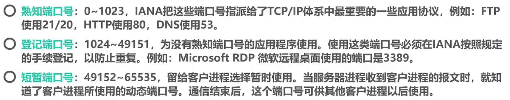
- UDP可以单播，多播，全播，广播；TCP只能一对一
- 连接只是可靠数据传输的必要条件
- 首部+数据部分（UDP用户数据报，TCP报文段）

#### TCP流量控制

滑动窗口

- seq：第一个字节数据的序号
- ACK=1 表示是确认字段；ack=201 表示201号以前的累计确认
- rwnd=300 接受窗口调整为300，流控
- 发送端：重传计时器
- 持续计时器（收到0窗口设置后启用）：超过时间后，发送1字节数据的0窗口探测报文段
- 0窗口报文段也有重传计时器
- 超时重传时间RTO，应略大于RTT

#### TCP拥塞控制

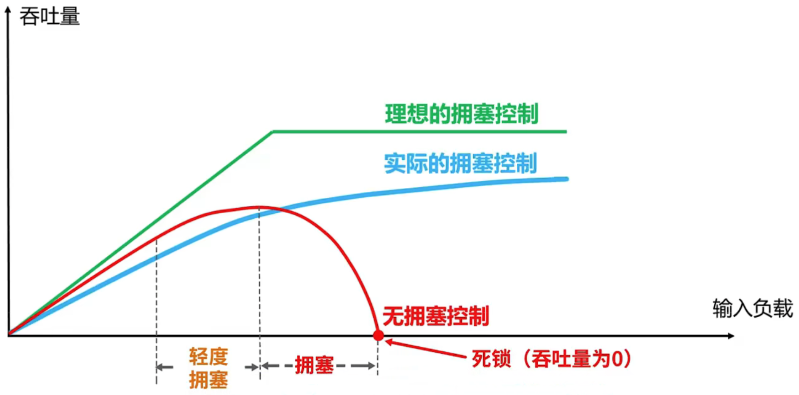

拥塞窗口cwnd，慢开始门限ssthresh

- 慢开始：初始为1，每轮后乘以2
- 拥塞避免：到ssthresh后每轮+1；重传计时器超时，ssthresh=cwnd/2，cwnd=1
- 快重传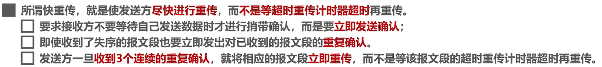
- 快恢复：收到三个重复确认，执行此算法。有取半，也有加3

#### TCP可靠传输的实现

- 基于以字节为单位的滑动串口
- 如何描述滑动窗口状态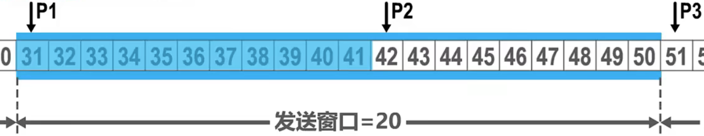
- 同一时刻，发送窗口不一定与接受窗口相等
- TCP是全双工通信

#### TCP连接的建立

- 普通的TCP确认报文段可以携带数据，不携带数据时不消耗序号
- SYN=1的不能携带数据，但消耗一个序号
- 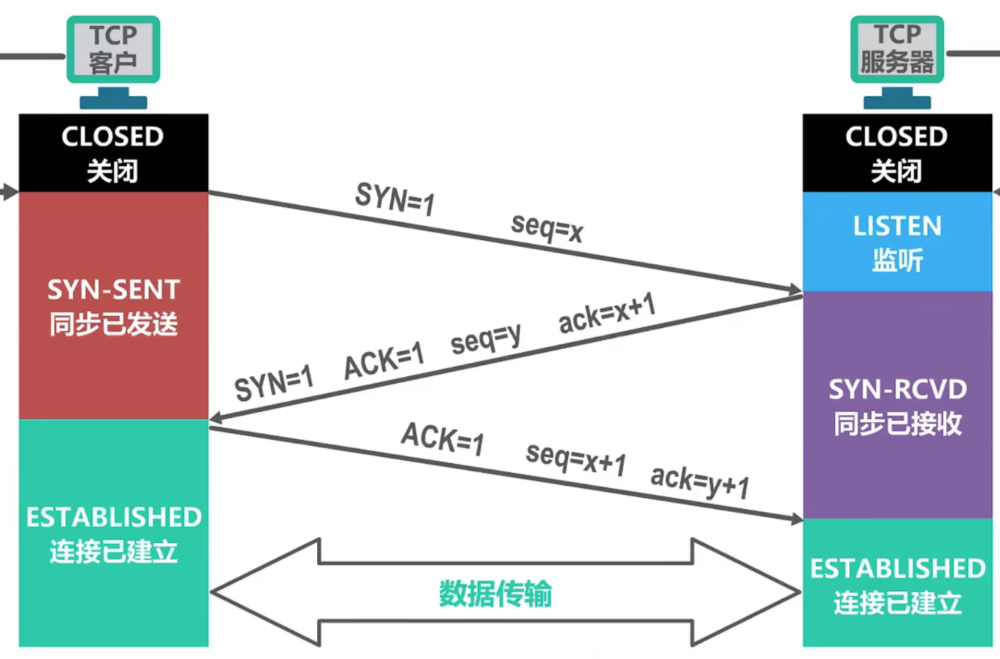
- 第三步为了防止失效的连接请求报文段突然到服务器
- 

#### TCP的连接释放

- seq发送的最后加1；ack收到的最后一个加1
- 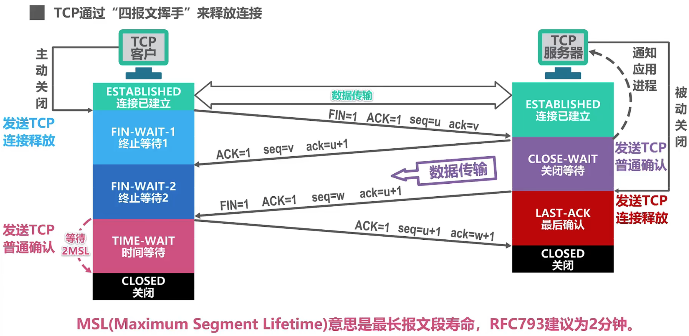

#### TCP报文段首部格式

- 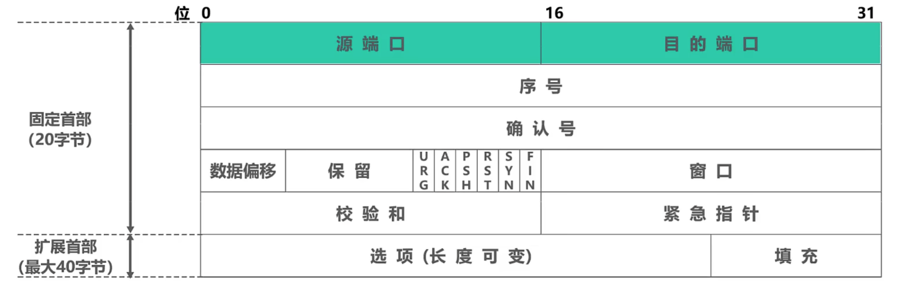
- 确认号：希望对方下一次传送的序列号，只有ACK=1时有效
- 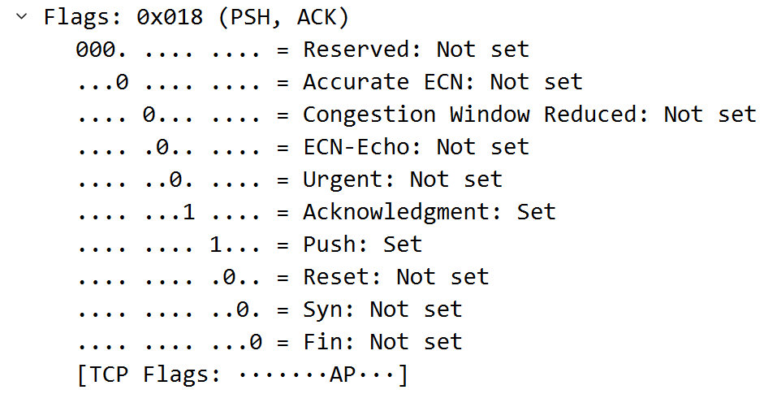
- 发送窗口是 $min(接受窗口，拥塞窗口)$
- 接受窗口大小如下图（不缩放 no scaling used）
- 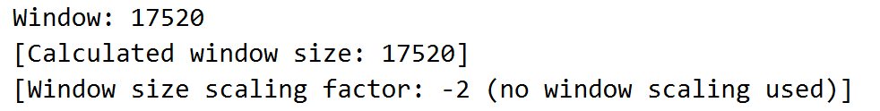
- 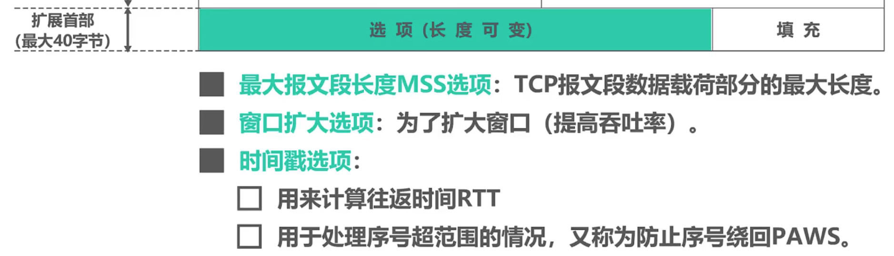
- 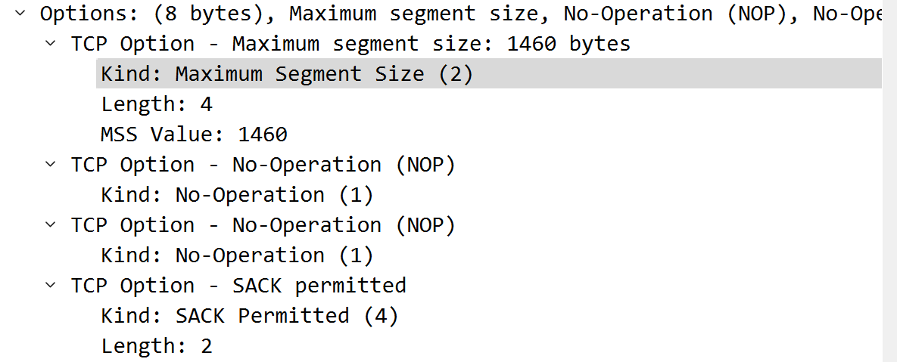
- 选择性确认（Selective Acknowledgment，SACK）是TCP协议的一种扩展机制，用于改进数据传输的可靠性和性能。当接收方启用了选择性确认机制后，在确认数据包时，它可以指示已经成功接收的连续和非连续数据块的范围。这样，发送方就可以知道哪些数据已经成功到达，哪些数据需要重新发送，从而提高数据传输的效率和可靠性。

## 应用层

- 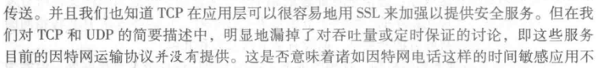
- 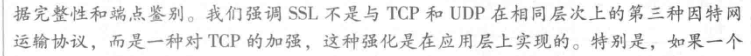
- cookie
- 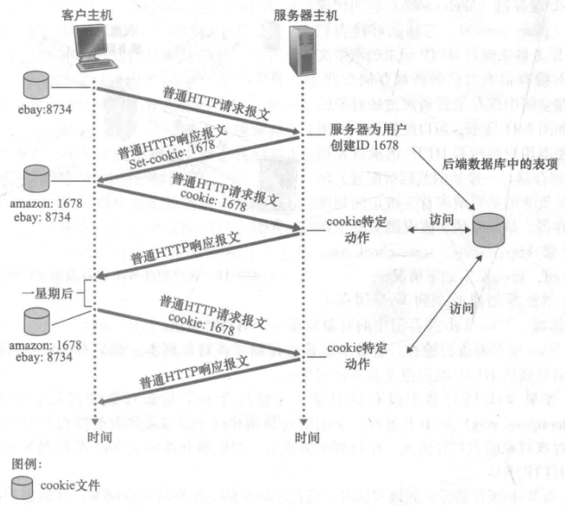

## 补充
